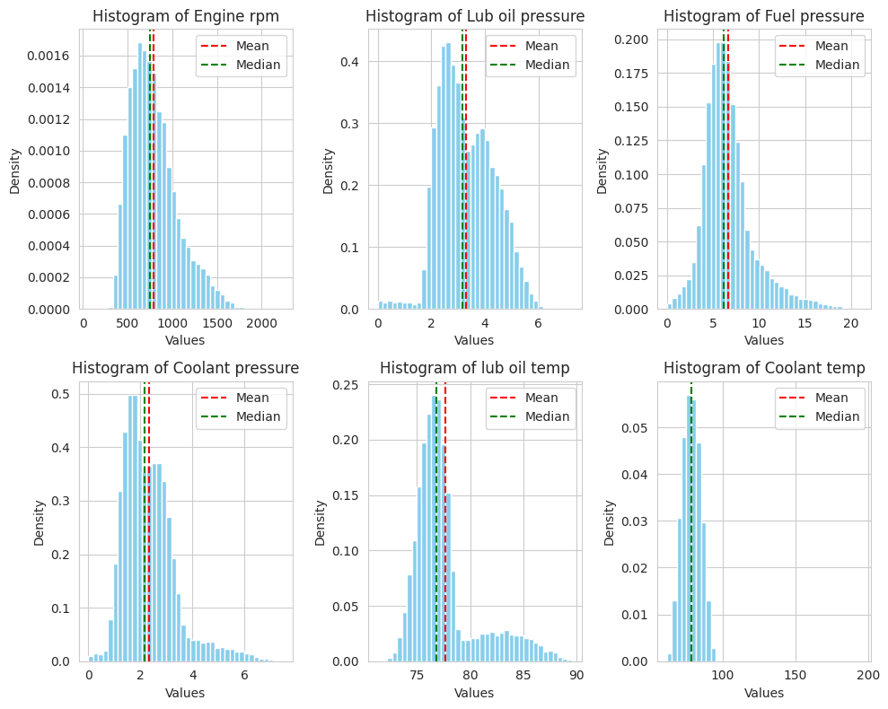
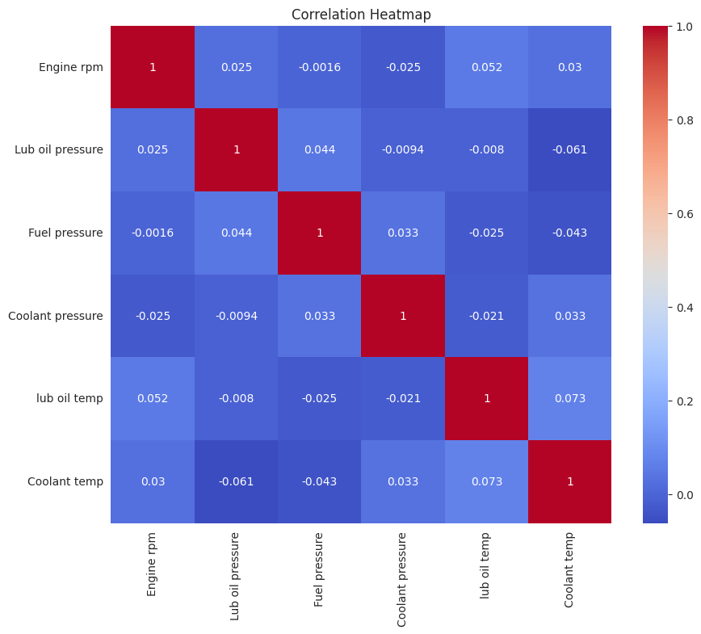
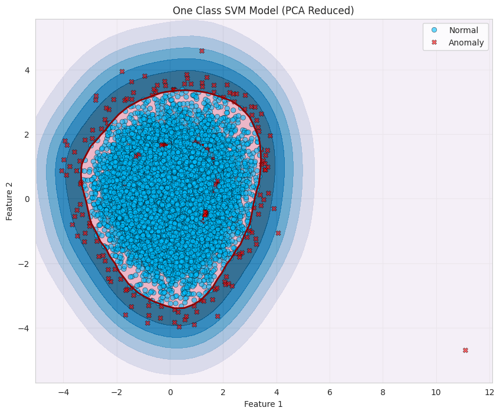
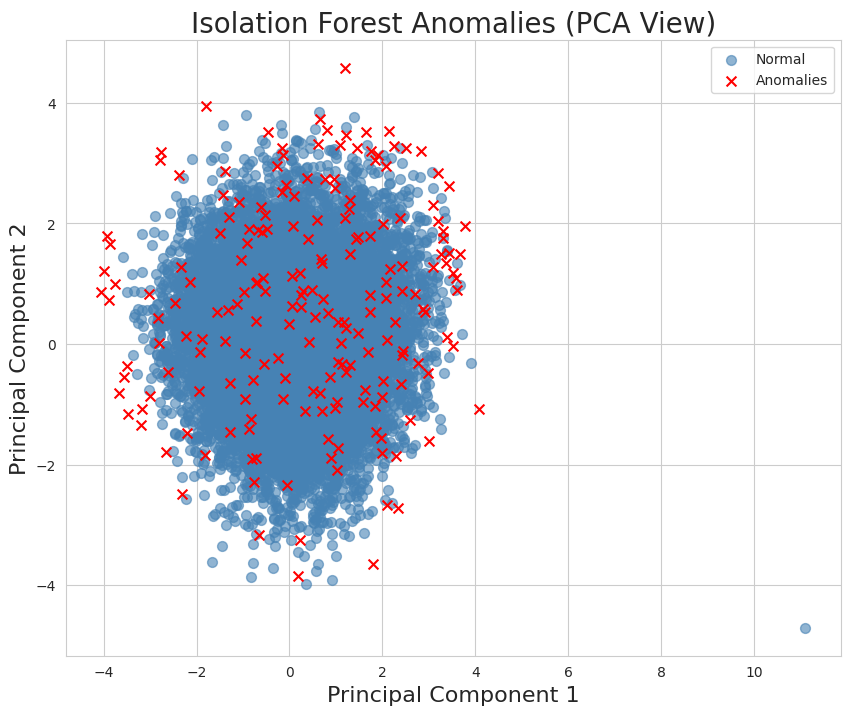

# 🚢 Anomaly Detection in Ship Engine Data

> Detecting anomalous engine behaviour using statistical and machine learning methods, 
> applied to 19,535 real-world sensor readings from a ship's engine.

---

## 📌 Overview

Unplanned engine failures at sea carry serious safety and financial consequences. 
This project builds a multi-method anomaly detection pipeline to identify abnormal 
engine states before they escalate — enabling a shift from reactive to predictive maintenance.

---

## Methods

| Stage | Method | Purpose |
|-------|--------|---------|
| 1 | Exploratory Data Analysis | Understand distributions, skew, and feature relationships |
| 2 | IQR Statistical Detection | Univariate baseline using multi-feature threshold |
| 3 | One-Class SVM | ML boundary model around normal operating region |
| 3 | Isolation Forest | Ensemble anomaly detection across full feature space |
| 4 | Cross-method comparison | Identify highest-confidence anomalies by agreement |

---

## Exploratory Data Analysis

All six features show right-skewed distributions with no missing or duplicate values.

Near-zero correlations across all features confirm that anomalies only emerge from 
*combinations* of sensor readings — motivating multivariate ML detection.

---

##  Model Results

| Method | Anomalies Flagged | % of Dataset |
|--------|------------------|--------------|
| IQR (T=2) | 422 | 2.16% |
| One-Class SVM (nu=0.01) | 198 | 1.01% |
| Isolation Forest (cont=0.01) | 196 | 1.00% |
| Two-Method Agreement | 176 | 0.90% |
| **All-Method Agreement** | **58** | **0.30%** |

---

##  Key Findings

Anomalous engine states are driven by **simultaneous elevation across multiple sensors** 
— not a single runaway reading.

| Feature | Normal Mean | Anomaly Mean | % Change |
|---------|------------|--------------|----------|
| Fuel Pressure | 6.617 | 10.513 | **+58.9%** |
| Coolant Pressure | 2.323 | 3.602 | **+55.1%** |
| Engine RPM | 788.5 | 1,058.1 | **+34.2%** |

---

##  Files

| File | Description |
|------|-------------|
| `notebook_anomaly_detection.ipynb` | Full annotated Colab notebook |
| `ship_engine_anomaly_report.pdf` | Written report with recommendations |

---

##  Tools & Libraries

